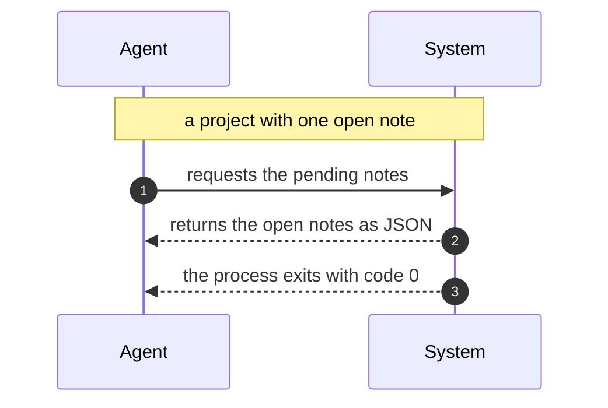
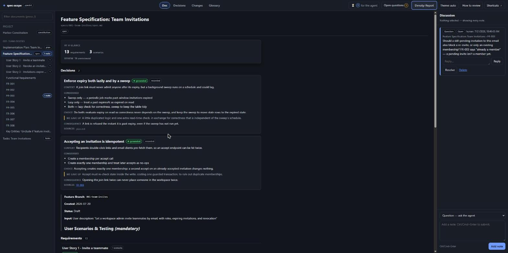
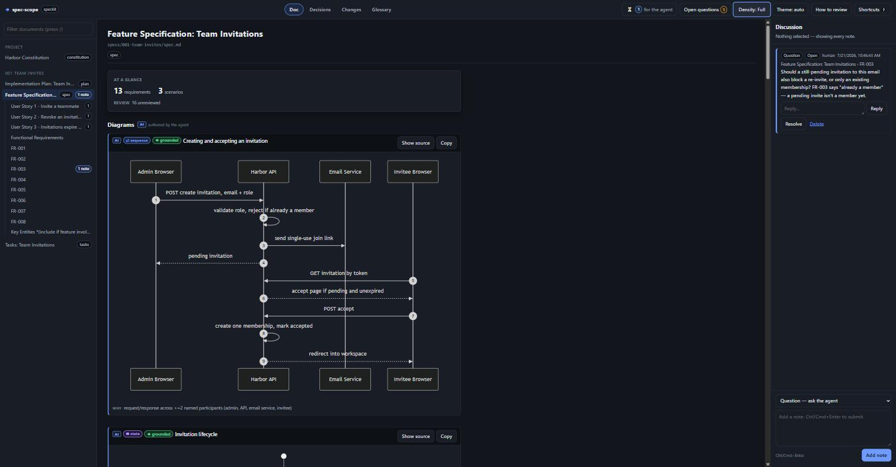
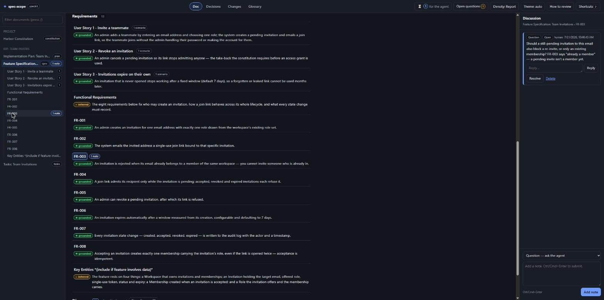
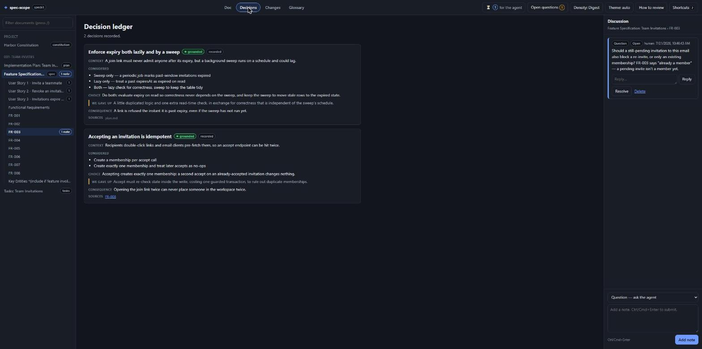
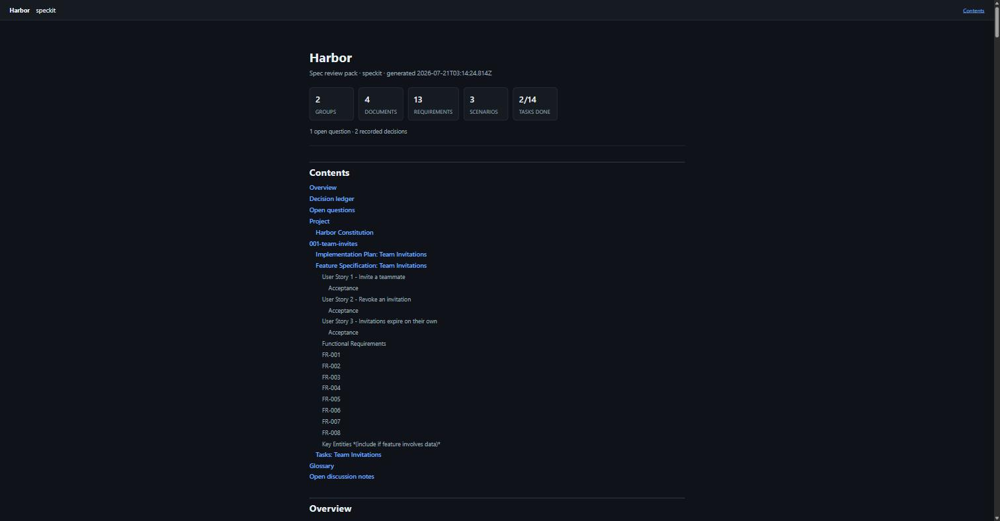

# spec-scope

**spec-scope reads a [Spec Kit](https://github.com/github/spec-kit) or [OpenSpec](https://github.com/Fission-AI/OpenSpec) project and renders its specifications in your browser with auto-generated Mermaid diagrams.** You annotate any requirement or scenario, and your AI agent picks those notes up over a long-poll — closing the loop between "the agent wrote a spec" and "a human actually reviewed it".

It exists because reviewing a spec as a wall of Markdown loses the thing you most need to review: the control flow. A `WHEN`/`THEN` scenario _is_ a sequence diagram written in prose. spec-scope draws it.

[](https://github.com/sizzlorox/spec-scope/actions/workflows/ci.yml)
[](https://www.npmjs.com/package/spec-scope)
[](./LICENSE)
[](https://nodejs.org)

---

## What you get

- **Requirement maps** — one diagram per spec document, showing which requirements own which scenarios.
- **Sequence charts** — auto-derived from your `WHEN`/`THEN` scenario steps, no diagram authoring required — now only when they earn it (a trivial scenario, fewer than two message arrows, renders as prose instead).
- **Agent-authored diagrams** — the higher-value diagrams a spec earns: a state machine for an entity's lifecycle, an ER diagram for a data model, an endpoint sequence. spec-scope has no model, so the agent in your loop authors these; spec-scope validates and renders them. Prose stays the default — a diagram has to earn its place. See [how diagrams are chosen](./docs/diagrams.md).
- **Task flows** — your `tasks.md` checklist as a dependency-ordered flow chart, with done state.
- **An anchored discussion loop** — leave a note on a requirement, a scenario, or a whole change. An agent polls for open notes, edits the spec, and resolves them.
- **A review layer that surfaces the _why_** — plain-language explanations, a decision ledger, a glossary, review verdicts, and a blast-radius view. Everything the agent generates is provenance-flagged (`grounded` / `inferred` / `unstated`), so nothing invented is ever shown as fact. See [the review layer](./docs/review-layer.md).
- **A one-file tech doc** — `spec-scope export` writes a single self-contained HTML file that leads with the plain overview, decisions and open questions, then every diagram inlined. Mail it, attach it to a PR, open it on a plane.

Everything runs on your machine. No account, no cloud, no telemetry.

## Quick start

In the root of an OpenSpec or Spec Kit project:

```bash
npx spec-scope
```

That detects the flavor, parses the spec tree, generates diagrams, and opens `http://127.0.0.1:4390` in your browser. Or install it properly:

```bash
npm install --save-dev spec-scope
```

No project handy? A prepared example ships with the repo — run `spec-scope examples/harbor` (or `node bin/spec-scope.js examples/harbor` in this checkout) to open on the populated report shown in the [screenshots](#screenshots) below. See [`examples/harbor`](./examples/harbor).

## Commands

| Command                             | What it does                                                                       |
| ----------------------------------- | ---------------------------------------------------------------------------------- |
| `spec-scope [dir]`                  | Start the review server. Default `dir` is `.`.                                     |
| `spec-scope poll [dir]`             | Block until there are open notes, print them, exit. For agents.                    |
| `spec-scope notes [dir]`            | List notes and exit.                                                               |
| `spec-scope resolve <noteId> [dir]` | Mark a note resolved.                                                              |
| `spec-scope reply <noteId> [msg]`   | Answer a note in its thread (as the agent). `msg` or stdin.                        |
| `spec-scope specs [dir]`            | List the reviewable specs and how much work each has left.                         |
| `spec-scope explain [dir]`          | List the explanation work an agent should write (`--spec <name>` to scope to one). |
| `spec-scope apply <file> [dir]`     | Merge a `ReviewBatch` the agent wrote back (`-` reads stdin).                      |
| `spec-scope decisions [dir]`        | Print the captured decision ledger.                                                |
| `spec-scope export [dir]`           | Write a self-contained HTML tech doc.                                              |
| `spec-scope --help` / `--version`   | The usual.                                                                         |

### Flags

| Flag            | Command                         | Default                         | Meaning                                                                                                                               |
| --------------- | ------------------------------- | ------------------------------- | ------------------------------------------------------------------------------------------------------------------------------------- |
| `--port <n>`    | start                           | `4390`                          | Port to listen on.                                                                                                                    |
| `--host <h>`    | start                           | `127.0.0.1`                     | Interface to bind. See [Privacy and security](#privacy-and-security) before changing this.                                            |
| `--no-open`     | start                           | off                             | Don't launch a browser.                                                                                                               |
| `--timeout <s>` | `poll`                          | `300`                           | Seconds to wait before giving up and exiting empty.                                                                                   |
| `--all`         | `notes`, `decisions`            | off                             | Include resolved notes / superseded decisions.                                                                                        |
| `--json`        | `notes`, `explain`, `decisions` | off                             | Machine-readable output.                                                                                                              |
| `--text`        | `explain`, `decisions`          | off                             | Human-readable long form. (These commands default to compact [TOON](#use-spec-scope-as-an-agent-skill-axi) — token-lean, for agents.) |
| `--spec <name>` | `explain`                       | all specs                       | Scope to one spec (a feature/change). Prepare specs one at a time. Run `spec-scope specs` to list them.                               |
| `--out <file>`  | `export`                        | `<root>/<project>.techdoc.html` | Where to write the tech doc.                                                                                                          |
| `--no-notes`    | `export`                        | off                             | Omit the discussion-notes appendix.                                                                                                   |

## How the diagrams are generated

Take a real OpenSpec scenario:

```markdown
### Requirement: Long-poll for open notes

The CLI SHALL block until a reviewer leaves a note or the timeout elapses.

#### Scenario: Agent receives a pending note

- **GIVEN** a project with one open note
- **WHEN** Agent: requests the pending notes
- **THEN** System: returns the open notes as JSON
- **AND** the process exits with code 0
```

spec-scope emits exactly this Mermaid source:

```
%% Long-poll for open notes / Agent receives a pending note
sequenceDiagram
  autonumber
  participant A0 as Agent
  participant A1 as System
  Note over A0,A1: a project with one open note
  A0->>A1: requests the pending notes
  A1-->>A0: returns the open notes as JSON
  A1-->>A0: the process exits with code 0
```

Each lane gets a generated alias (`A0`, `A1`) so a participant whose name collides
with a Mermaid keyword can't break the diagram; the `as Agent` label is what you see
rendered. Which renders as:



The mapping rules are deliberately small:

| Step keyword  | Becomes                                                               |
| ------------- | --------------------------------------------------------------------- |
| `GIVEN`       | A `Note over` spanning both participants — setup, not an interaction. |
| `WHEN`        | A solid arrow (`->>`) from the actor to the counterpart.              |
| `THEN`        | A dashed reply arrow (`-->>`) back.                                   |
| `AND` / `BUT` | Repeats the direction of the preceding keyword.                       |

### Actor detection is a heuristic — read this

spec-scope recognises **one** actor annotation form:

```markdown
- **WHEN** Agent: requests the pending notes
```

A capitalised word (or short phrase) followed by a colon, immediately after the bolded keyword. That's it. If a step doesn't match that shape, spec-scope falls back to two generic participants — `User` for `GIVEN`/`WHEN` steps and `System` for `THEN` steps.

This means an unannotated scenario still produces a readable two-lane diagram, but it will not discover that your spec is really about three services talking to each other. There is no NLP here and none is planned. If you want precise participants, annotate your steps; the annotation is plain Markdown and stays readable to humans and to every other tool that reads your specs.

### Higher-value diagrams the agent authors

The derived charts above are mechanical — and now suppressed when trivial, so a scenario with fewer than two message arrows reads as prose instead of a two-box picture. The diagrams worth more than that — a state machine for an entity's lifecycle, an ER diagram for a data model, an endpoint sequence — need judgement about what the spec _means_, which no derivation has. spec-scope has no language model, so the **agent already in your loop** authors those through the [review loop](./docs/review-layer.md); spec-scope validates them (a valid Mermaid header per type, a 3-node floor, a 24-node ceiling) and renders them, exactly as it does the agent's explanations. The default is still prose — a diagram earns its place or it is not drawn, and "no diagram warranted" is recorded honestly rather than left silent. The rubric the agent follows — whether, which type, and at what altitude — is in [docs/diagrams.md](./docs/diagrams.md).

## Working with an AI agent

The loop spec-scope is built for:

1. Your agent writes or edits a spec.
2. You run `spec-scope` and review the rendered diagrams.
3. You attach notes to the requirements or scenarios that are wrong.
4. Your agent runs `spec-scope poll`, gets the notes, and edits the spec.
5. The agent runs `spec-scope resolve <noteId>` for each one it addressed.
6. Repeat until there are no open notes.

Copy-pasteable, from the agent's side:

```bash
# Block for up to 5 minutes waiting for the human to say something.
# Exits with an empty list on timeout, so this is safe in a loop.
spec-scope poll --timeout 300

# ... edit the spec files based on what came back ...

# Then close each note out by id.
spec-scope resolve note_abc123
```

Machine-readable listing, if you'd rather drive it yourself:

```bash
spec-scope notes --json
```

Add something like this to your agent's instructions file (`AGENTS.md`, `CLAUDE.md`, a Cursor rule — wherever your agent reads from):

```markdown
After writing or changing any spec, run `spec-scope poll --timeout 300` and wait
for review notes. Address each note by editing the spec, then run
`spec-scope resolve <noteId>`. Do not start implementation while notes are open.
```

## Use spec-scope as an agent skill (AXI)

spec-scope ships as an **agent skill** — install it once and your agent knows the whole loop: open the review for you, answer your questions in the thread, write the plain-language layer and the decision ledger, and export the tech doc. Under Claude Code / the Skills CLI:

```bash
npx skills add sizzlorox/spec-scope --skill spec-scope
```

The skill lives in [`skills/spec-scope/SKILL.md`](./skills/spec-scope/SKILL.md); if your agent runner uses a different mechanism, point it there.

It's built as an **AXI** (Agent eXecutable Interface) — the same idea as [lavish-axi](https://github.com/kunchenguid/lavish-axi), but for specs instead of HTML artifacts. That means the agent-facing surface is optimized for an agent to drive cheaply:

- **Long-poll, not busy-wait.** `spec-scope poll` blocks and returns the moment there's something to do.
- **Contextual disclosure.** `explain` lists only what's _missing or stale_ and `poll` returns only _open_ notes — the agent never pays tokens for work that's already done.
- **TOON output by default.** `spec-scope explain` / `decisions` return [TOON](https://github.com/toon-format/toon) (Token-Oriented Object Notation) — keys stated once, rows CSV-style. On a real work list that's roughly a **70–75% token cut** versus `--json`, because the honesty rules live in the skill instead of being repeated on every row. (`--json` for the full data, `--text` for a human.)
- **`next_step` on every output.** Each agent-facing command ends with an imperative telling the agent what to do next, so the loop stays anchored even mid-run.
- **Conversational.** `spec-scope reply <noteId>` lets the agent answer a question in its thread without closing it — the report becomes a back-and-forth, not a one-shot parse.

The honesty contract carries into the skill: every line the agent writes is flagged `grounded` / `inferred` / `unstated`, and an `unstated` gap becomes an open question rather than a fabricated rationale. See [the review layer](./docs/review-layer.md) for the full loop.

## Where notes live

Notes are stored in `.spec-scope/notes.json` at your project root. Whether you commit that file is a real decision, not an oversight:

- **Commit it** to review specs as a team. Notes show up in PR diffs, review history is preserved alongside the specs it describes, and a teammate can pick up an unresolved thread.
- **Gitignore it** to keep review ephemeral. Notes are a conversation between you and your agent during one working session, and nobody needs the archaeology.

There is no wrong answer. Pick one on purpose. If you gitignore it, add:

```gitignore
.spec-scope/
```

## The review layer

Reviewing a spec tells you _what_ the system should do. It rarely tells you _why_ — which option was
chosen, what got traded away, what a term of art means. The review layer surfaces that, and it does so
without inventing anything.

spec-scope has no language model. The **agent already in your loop** writes the explanations; spec-scope
stores, checks, and renders them. Every generated line carries a provenance flag:

- **`grounded`** — restates the spec, cited.
- **`inferred`** — the agent's reading of unstated intent, shown as a claim you can dispute.
- **`unstated`** — the rationale genuinely isn't recorded, so it becomes an **open question**, never a
  made-up reason.

Explanations also go **stale** rather than silently wrong: each is pinned to a hash of the spec text it
explains, and is flagged the moment that text changes.

You get a plain-language layer under each requirement, scenario narration hover-synced to the sequence
diagram, a **decision ledger**, review verdicts with a heat signal, a **blast-radius** view (what does
changing this touch?), a prose **what-changed** view, and a glossary that flags undefined terms instead
of guessing at them. The agent side is one more turn of the same loop:

```bash
spec-scope explain            # what still needs a summary, narration, glossary def, decision write-up, or diagram
# ... the agent writes the content, grounding each item and setting provenance honestly ...
spec-scope apply batch.json   # merge it back (or `spec-scope apply -` from stdin)
spec-scope decisions          # read the captured ledger
```

Full details, the `ReviewBatch` shape, and the HTTP API are in **[docs/review-layer.md](./docs/review-layer.md)**.

## Supported layouts

spec-scope detects the flavor by looking for these markers. Both layouts are read-only — spec-scope never edits your specs.

### OpenSpec

```
openspec/
  project.md
  specs/
    <capability>/
      spec.md            # ### Requirement: / #### Scenario:
  changes/
    <change-id>/
      proposal.md
      tasks.md
      design.md
      specs/
        <capability>/
          spec.md        # ## ADDED Requirements, ## MODIFIED Requirements, ...
    archive/
      <change-id>/       # parsed, flagged as archived
```

### Spec Kit

```
.specify/
  memory/
    constitution.md
specs/
  001-some-feature/
    spec.md              # user stories, FR-NNN requirements, acceptance criteria
    plan.md
    tasks.md
    research.md
    data-model.md
```

Full grammar for both dialects, including what is deliberately ignored, is in [`docs/spec-formats.md`](./docs/spec-formats.md).

## Screenshots

_The spec shown below — a "Team Invitations" feature — comes from running a real Spec Kit flow through spec-scope end to end: `specify init`, a constitution, a spec/plan/tasks, then an agent-prepared review._

**Report view** — the spec as an executive summary. The default reading density leads with the at-a-glance counts and the decisions that shaped the spec, then lists every requirement as one line of plain language. (Cycle to Digest or Full for the cards and the formal text.)



**Authored diagrams** — the agent draws a sequence, state or ER diagram when a structure earns one, each carrying its own provenance.



**Discussion** — ask a question or request a change on any requirement; the thread queues for the in-loop agent to answer.



**Decision ledger** — every recorded decision with its context, the options weighed, the choice, and what it traded away.



**One-file tech doc** — `spec-scope export` writes a single self-contained HTML report you can hand to anyone.



## Privacy and security

- **Everything is local.** spec-scope reads files from disk and serves them from a process on your machine.
- **Binds `127.0.0.1` by default.** The server has no authentication of any kind. Passing `--host 0.0.0.0` publishes your unreleased specifications to everyone on your network. Don't, unless you have thought about it.
- **No telemetry, no network calls at runtime.** Mermaid and Marked are vendored from `node_modules` and served locally — nothing is fetched from a CDN, at dev time or in an exported tech doc.
- **Spec Markdown is untrusted input** and is sanitised before rendering. So is everything in `.spec-scope/` — a committed `review.json` or `notes.json` from a cloned repo is treated as hostile and sanitised the same way.
- **The review server's write routes are guarded.** Creating notes, stamps or decisions requires a same-origin request; a cross-site page you happen to have open cannot write to your local server.

See [SECURITY.md](./SECURITY.md) for the full threat model and how to report a vulnerability.

## Roadmap

> **Not built yet.** This section is intent, not documentation. Nothing here works today.

- Coverage hints — flag requirements with no scenarios, and scenarios with no `THEN`.
- More dialects — plain Gherkin `.feature` files, ADR directories.
- Semantic blast radius — the current downstream view matches on shared terms (lexical); relate requirements by meaning instead.
- Export to Markdown as well as HTML, for wikis that won't take a single-file bundle.
- Spec version diffs — compare two revisions of a spec, not just the in-file OpenSpec delta markers the [what-changed view](./docs/review-layer.md) already renders.

Opinions on any of these belong in an [issue](https://github.com/sizzlorox/spec-scope/issues).

## Contributing

See [CONTRIBUTING.md](./CONTRIBUTING.md) for dev setup, project layout, commit conventions, and how to add a new diagram generator or spec dialect. By participating you agree to the [Code of Conduct](./CODE_OF_CONDUCT.md).

## License

[MIT](./LICENSE) © sizzlorox
