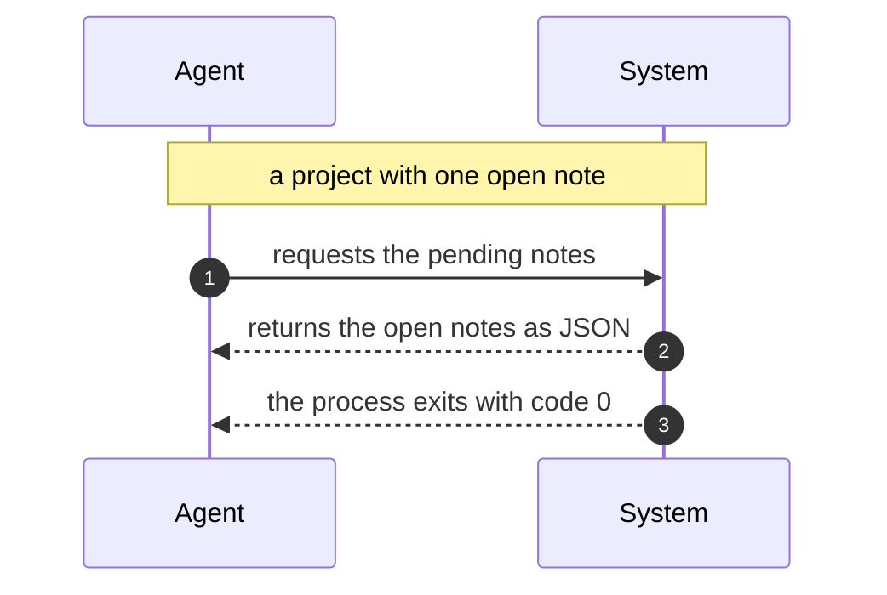

# spec-scope

**spec-scope reads a [Spec Kit](https://github.com/github/spec-kit) or [OpenSpec](https://github.com/Fission-AI/OpenSpec) project and renders its specifications in your browser with auto-generated Mermaid diagrams.** You annotate any requirement or scenario, and your AI agent picks those notes up over a long-poll — closing the loop between "the agent wrote a spec" and "a human actually reviewed it".

It exists because reviewing a spec as a wall of Markdown loses the thing you most need to review: the control flow. A `WHEN`/`THEN` scenario _is_ a sequence diagram written in prose. spec-scope draws it.

[](https://github.com/sizzlorox/spec-scope/actions/workflows/ci.yml)
[](https://www.npmjs.com/package/spec-scope)
[](./LICENSE)
[](https://nodejs.org)

---

## What you get

- **Requirement maps** — one diagram per spec document, showing which requirements own which scenarios.
- **Sequence charts** — generated from your `WHEN`/`THEN` scenario steps, no diagram authoring required.
- **Task flows** — your `tasks.md` checklist as a dependency-ordered flow chart, with done state.
- **An anchored discussion loop** — leave a note on a requirement, a scenario, or a whole change. An agent polls for open notes, edits the spec, and resolves them.
- **A one-file tech doc** — `spec-scope export` writes a single self-contained HTML file with every diagram already inlined. Mail it, attach it to a PR, open it on a plane.

Everything runs on your machine. No account, no cloud, no telemetry.

## Quick start

In the root of an OpenSpec or Spec Kit project:

```bash
npx spec-scope
```

That detects the flavor, parses the spec tree, generates diagrams, and opens `http://127.0.0.1:4390` in your browser. Or install it properly:

```bash
npm install --save-dev spec-scope
```

## Commands

| Command                             | What it does                                                    |
| ----------------------------------- | --------------------------------------------------------------- |
| `spec-scope [dir]`                  | Start the review server. Default `dir` is `.`.                  |
| `spec-scope poll [dir]`             | Block until there are open notes, print them, exit. For agents. |
| `spec-scope notes [dir]`            | List notes and exit.                                            |
| `spec-scope resolve <noteId> [dir]` | Mark a note resolved.                                           |
| `spec-scope export [dir]`           | Write a self-contained HTML tech doc.                           |
| `spec-scope --help` / `--version`   | The usual.                                                      |

### Flags

| Flag            | Command  | Default                         | Meaning                                                                                    |
| --------------- | -------- | ------------------------------- | ------------------------------------------------------------------------------------------ |
| `--port <n>`    | start    | `4390`                          | Port to listen on.                                                                         |
| `--host <h>`    | start    | `127.0.0.1`                     | Interface to bind. See [Privacy and security](#privacy-and-security) before changing this. |
| `--no-open`     | start    | off                             | Don't launch a browser.                                                                    |
| `--timeout <s>` | `poll`   | `300`                           | Seconds to wait before giving up and exiting empty.                                        |
| `--all`         | `notes`  | off                             | Include resolved notes, not just open ones.                                                |
| `--json`        | `notes`  | off                             | Machine-readable output.                                                                   |
| `--out <file>`  | `export` | `<root>/<project>.techdoc.html` | Where to write the tech doc.                                                               |

## How the diagrams are generated

Take a real OpenSpec scenario:

```markdown
### Requirement: Long-poll for open notes

The CLI SHALL block until a reviewer leaves a note or the timeout elapses.

#### Scenario: Agent receives a pending note

- **GIVEN** a project with one open note
- **WHEN** Agent: requests the pending notes
- **THEN** System: returns the open notes as JSON
- **AND** the process exits with code 0
```

spec-scope emits exactly this Mermaid source:

```
%% Long-poll for open notes / Agent receives a pending note
sequenceDiagram
  autonumber
  participant A0 as Agent
  participant A1 as System
  Note over A0,A1: a project with one open note
  A0->>A1: requests the pending notes
  A1-->>A0: returns the open notes as JSON
  A1-->>A0: the process exits with code 0
```

Each lane gets a generated alias (`A0`, `A1`) so a participant whose name collides
with a Mermaid keyword can't break the diagram; the `as Agent` label is what you see
rendered. Which renders as:



The mapping rules are deliberately small:

| Step keyword  | Becomes                                                               |
| ------------- | --------------------------------------------------------------------- |
| `GIVEN`       | A `Note over` spanning both participants — setup, not an interaction. |
| `WHEN`        | A solid arrow (`->>`) from the actor to the counterpart.              |
| `THEN`        | A dashed reply arrow (`-->>`) back.                                   |
| `AND` / `BUT` | Repeats the direction of the preceding keyword.                       |

### Actor detection is a heuristic — read this

spec-scope recognises **one** actor annotation form:

```markdown
- **WHEN** Agent: requests the pending notes
```

A capitalised word (or short phrase) followed by a colon, immediately after the bolded keyword. That's it. If a step doesn't match that shape, spec-scope falls back to two generic participants — `User` for `GIVEN`/`WHEN` steps and `System` for `THEN` steps.

This means an unannotated scenario still produces a readable two-lane diagram, but it will not discover that your spec is really about three services talking to each other. There is no NLP here and none is planned. If you want precise participants, annotate your steps; the annotation is plain Markdown and stays readable to humans and to every other tool that reads your specs.

## Working with an AI agent

The loop spec-scope is built for:

1. Your agent writes or edits a spec.
2. You run `spec-scope` and review the rendered diagrams.
3. You attach notes to the requirements or scenarios that are wrong.
4. Your agent runs `spec-scope poll`, gets the notes, and edits the spec.
5. The agent runs `spec-scope resolve <noteId>` for each one it addressed.
6. Repeat until there are no open notes.

Copy-pasteable, from the agent's side:

```bash
# Block for up to 5 minutes waiting for the human to say something.
# Exits with an empty list on timeout, so this is safe in a loop.
spec-scope poll --timeout 300

# ... edit the spec files based on what came back ...

# Then close each note out by id.
spec-scope resolve note_abc123
```

Machine-readable listing, if you'd rather drive it yourself:

```bash
spec-scope notes --json
```

Add something like this to your agent's instructions file (`AGENTS.md`, `CLAUDE.md`, a Cursor rule — wherever your agent reads from):

```markdown
After writing or changing any spec, run `spec-scope poll --timeout 300` and wait
for review notes. Address each note by editing the spec, then run
`spec-scope resolve <noteId>`. Do not start implementation while notes are open.
```

## Where notes live

Notes are stored in `.spec-scope/notes.json` at your project root. Whether you commit that file is a real decision, not an oversight:

- **Commit it** to review specs as a team. Notes show up in PR diffs, review history is preserved alongside the specs it describes, and a teammate can pick up an unresolved thread.
- **Gitignore it** to keep review ephemeral. Notes are a conversation between you and your agent during one working session, and nobody needs the archaeology.

There is no wrong answer. Pick one on purpose. If you gitignore it, add:

```gitignore
.spec-scope/
```

## Supported layouts

spec-scope detects the flavor by looking for these markers. Both layouts are read-only — spec-scope never edits your specs.

### OpenSpec

```
openspec/
  project.md
  specs/
    <capability>/
      spec.md            # ### Requirement: / #### Scenario:
  changes/
    <change-id>/
      proposal.md
      tasks.md
      design.md
      specs/
        <capability>/
          spec.md        # ## ADDED Requirements, ## MODIFIED Requirements, ...
    archive/
      <change-id>/       # parsed, flagged as archived
```

### Spec Kit

```
.specify/
  memory/
    constitution.md
specs/
  001-some-feature/
    spec.md              # user stories, FR-NNN requirements, acceptance criteria
    plan.md
    tasks.md
    research.md
    data-model.md
```

Full grammar for both dialects, including what is deliberately ignored, is in [`docs/spec-formats.md`](./docs/spec-formats.md).

## Screenshots

> **Note:** the images below are placeholders. `docs/media/` is not populated yet — contributions welcome, see [CONTRIBUTING.md](./CONTRIBUTING.md).

|                           |                                                 |
| ------------------------- | ----------------------------------------------- |
| `docs/media/overview.png` | The spec tree with a generated requirement map. |
| `docs/media/sequence.png` | A scenario rendered as a sequence chart.        |
| `docs/media/notes.png`    | Attaching a note to a requirement.              |
| `docs/media/techdoc.png`  | An exported one-file tech doc.                  |

## Privacy and security

- **Everything is local.** spec-scope reads files from disk and serves them from a process on your machine.
- **Binds `127.0.0.1` by default.** The server has no authentication of any kind. Passing `--host 0.0.0.0` publishes your unreleased specifications to everyone on your network. Don't, unless you have thought about it.
- **No telemetry, no network calls at runtime.** Mermaid and Marked are vendored from `node_modules` and served locally — nothing is fetched from a CDN, at dev time or in an exported tech doc.
- **Spec Markdown is untrusted input** and is sanitised before rendering.

See [SECURITY.md](./SECURITY.md) for the full threat model and how to report a vulnerability.

## Roadmap

> **Not built yet.** This section is intent, not documentation. Nothing here works today.

- Diff view — render what an OpenSpec change adds, modifies and removes against the current capability spec.
- Coverage hints — flag requirements with no scenarios, and scenarios with no `THEN`.
- More dialects — plain Gherkin `.feature` files, ADR directories.
- Cross-document links — resolve a `tasks.md` entry back to the requirement it implements.
- Export to Markdown as well as HTML, for wikis that won't take a single-file bundle.

Opinions on any of these belong in an [issue](https://github.com/sizzlorox/spec-scope/issues).

## Contributing

See [CONTRIBUTING.md](./CONTRIBUTING.md) for dev setup, project layout, commit conventions, and how to add a new diagram generator or spec dialect. By participating you agree to the [Code of Conduct](./CODE_OF_CONDUCT.md).

## License

[MIT](./LICENSE) © sizzlorox
