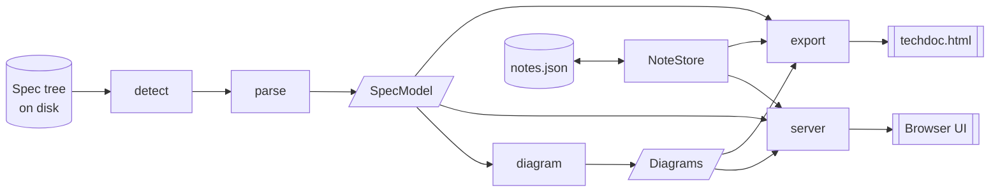

# Architecture

spec-scope is a pipeline with two exits. Markdown goes in, a model comes out, diagrams are derived
from the model, and the result is either served to a browser or flattened into a single HTML file.



The important property: **each stage depends only on the stage before it.** `parse` is the only
module that knows what Markdown looks like. `diagram` reads the model and never touches the disk.
`server` and `export` are siblings — neither knows about the other, and both consume exactly the same
`SpecModel` + `Diagram[]` + `Note[]`. Adding a third exit (a Markdown export, a static site) means
writing one more consumer, not touching the pipeline.

## Modules

| Module           | Responsibility                                                                       |
| ---------------- | ------------------------------------------------------------------------------------ |
| `src/types.ts`   | The entire data model. No logic. Everything downstream reads this and nothing else.  |
| `src/ids.ts`     | Stable, name-derived identifiers. Pure.                                              |
| `src/detect.ts`  | Locate the project root, identify the flavor, return the directories worth scanning. |
| `src/parse.ts`   | Walk the spec dirs, parse Markdown into `SpecModel`. The only Markdown-aware module. |
| `src/diagram.ts` | `SpecModel` → `Diagram[]`. Pure, synchronous, no I/O.                                |
| `src/notes.ts`   | `NoteStore`: persistence, long-poll, and change notification for discussion notes.   |
| `src/vendor.ts`  | Resolve and read the vendored Mermaid/Marked bundles out of `node_modules`.          |
| `src/server.ts`  | Local HTTP server: static assets, JSON API, SSE change stream.                       |
| `src/export.ts`  | Render the model, diagrams and notes into one self-contained HTML file.              |
| `src/cli.ts`     | Argument parsing and dispatch. Holds no business logic.                              |
| `web/`           | The browser UI. Plain HTML, CSS and ES modules — no framework, no build step.        |

### detect

`detectProject(dir)` walks upward from `dir` looking for flavor markers (an `openspec/` directory, a
`.specify/` directory) and returns `{ root, flavor, specDirs }` with `root` absolute and normalised.
Everything downstream works from `root` and POSIX-style relative paths, which is what keeps Windows
from leaking backslashes into ids, note anchors and exported documents.

### parse

`parseProject(dir)` is the async shell: detect, walk, read files, assemble a `SpecModel`. Inside it
sit two pure functions that carry all the interesting logic and all the tests:

- `classifyDoc(relPath): DocKind` — filename to role (`spec`, `proposal`, `plan`, `tasks`,
  `constitution`, …).
- `parseMarkdown(markdown, relPath): SpecDoc` — the grammar itself.

The parser is **line-oriented and regex-driven**, not an AST walk. It's a deliberate ceiling: spec
Markdown is a narrow, heading-driven dialect, and a line scanner is easier to extend, easier to
debug, and produces better line numbers for anchoring notes. The known cost is that inline Markdown
inside a heading or a step is treated as text. See [`spec-formats.md`](./spec-formats.md) for the
exact grammar.

Non-fatal problems — an unreadable file, a scenario with no steps, a requirement outside any
recognised heading — accumulate in `SpecModel.warnings` rather than throwing. A malformed spec file
should degrade one document, not fail the whole run.

Every `SpecDoc` keeps its original `markdown`, so the UI renders prose faithfully instead of
round-tripping it through the model.

### diagram

Pure functions, one per diagram kind, all returning `Diagram | null`:

| Function                                  | Produces                                                  |
| ----------------------------------------- | --------------------------------------------------------- |
| `scenarioSequence(scenario, requirement)` | `sequenceDiagram` from the scenario's steps.              |
| `requirementMap(doc)`                     | Requirements and their scenarios for one document.        |
| `taskFlow(doc)`                           | Checklist as a flow chart, carrying done state.           |
| `groupOverview(group, model)`             | The documents in a change or feature and how they relate. |
| `generateDiagrams(model)`                 | Runs all of the above across the model.                   |

`null` means "nothing worth drawing" — no requirements, no tasks, a single lonely node. An empty
diagram panel is worse than no panel.

Every `Diagram` carries an `anchor`: the id of the thing it depicts. That's what lets a reader attach
a note to the requirement a diagram is about rather than to the diagram itself, which is why a wrong
anchor is a real bug and not a cosmetic one.

All interpolated text goes through `escapeMermaid()`. It rewrites the characters that would
otherwise break Mermaid's parser: a literal `;` (Mermaid's statement separator, which cannot be
entity-escaped) becomes a full-width look-alike `；`, and `#`, `%`, `` ` ``, `"`, `(`, `)`, `[`, `]`,
`{` and `}` are replaced with numeric-entity escapes. Colons and angle brackets are not on that
list. Skipping the escape is the most common cause of a blank diagram.

### notes

`NoteStore` owns `<root>/.spec-scope/notes.json` and is the only writer. Beyond ordinary CRUD it
provides the two operations the agent loop needs:

- `wait({ timeoutMs, signal })` — resolves with the open notes as soon as there are any, or `[]` when
  the timeout elapses. This backs `spec-scope poll`. Resolving empty on timeout rather than throwing
  is what makes it safe to call in a shell loop.
- `onChange(listener)` — returns an unsubscribe function. Backs the SSE `notes` event.

Writes are atomic (write to a temp file, rename over the target) so a crash mid-write can't leave a
truncated notes file. `close()` releases watchers and pending waiters.

### server

A plain `node:http` server. No Express, no middleware stack, no dependency. It serves the `web/`
directory, the two vendored bundles, a small JSON API, and an SSE stream. Default bind is
`127.0.0.1`; there is no authentication, which is precisely why the default matters. It does reject
cross-site mutating requests (an `Origin` / `Sec-Fetch-Site` / `Content-Type` guard on `POST` and
`DELETE`) and validate the `Host` header as a DNS-rebinding defence, but those protect the browser
attack surface, not a local process. See [SECURITY.md](../SECURITY.md).

It watches the spec directories and re-runs the pipeline on change, pushing a `model` SSE event.
`fs.watch` semantics differ meaningfully across platforms, which is why CI runs a Windows job.

### export

Same inputs as the server, one output file. `renderTechDoc()` is pure — model, diagrams, notes and
the two vendor bundles in, an HTML string out — which makes it testable without touching the disk.
`exportTechDoc()` is the I/O shell around it and returns the written path.

The output inlines Mermaid and Marked verbatim. That's what makes it work with no network at all,
and it's why an exported document is a point-in-time snapshot of those libraries — see the threat
model in [SECURITY.md](../SECURITY.md).

## The id scheme

Ids are **derived from names, not from positions**. `src/ids.ts` is the only place they're built.

```
doc:openspec-changes-add-poll-proposal-md
doc:openspec-specs-review-spec-md/req:long-poll-for-open-notes
doc:openspec-specs-review-spec-md/req:long-poll-for-open-notes/scn:agent-receives-a-pending-note
group:openspec-changes-add-poll
dgm:sequence:doc-openspec-specs-review-spec-md-req-long-poll...
note_lq3k9f2a7b1c
```

The hierarchy is visible in the id, so a scenario id names its requirement and its document. That
makes anchors debuggable by eye and lets the UI resolve a breadcrumb without a lookup table.

**Why name-derived?** Because a note written today has to still point at the right requirement
tomorrow. Specs are edited constantly: requirements get reordered, prose is rewritten around them,
files gain sections. An offset-based or index-based id breaks on every one of those. A slug of the
requirement's name survives all of them.

The tradeoff is honest and worth stating: **renaming a requirement orphans its notes.** That's the
accepted cost. Renaming a requirement usually _does_ mean it became a different requirement, so
re-reading the notes attached to it is the right outcome more often than not. To soften the failure,
every `Note` stores an `anchorLabel` — a human-readable breadcrumb — so an orphaned note still tells
you what it was about instead of showing a dead id.

Task ids are the exception: `taskId(docId, index)` is positional, because checklist items have no
stable name and reordering a checklist genuinely does change what each entry means.

`newId(prefix, now)` builds note and reply ids from a base-36 timestamp plus randomness, so they sort
lexically in creation order.

## Notes file format

`<root>/.spec-scope/notes.json`:

```json
{
  "version": 1,
  "notes": [
    {
      "id": "note_lq3k9f2a7b1c",
      "anchor": "doc:openspec-specs-review-spec-md/req:long-poll-for-open-notes",
      "anchorLabel": "review/spec.md › Long-poll for open notes",
      "kind": "change",
      "body": "The timeout default should be configurable per project, not just per invocation.",
      "author": "alex",
      "createdAt": "2026-03-14T09:21:44.310Z",
      "status": "open",
      "replies": [
        {
          "id": "rep_lq3kb81f3d2e",
          "body": "Agreed — reading it from a config file. Adding a requirement for it.",
          "author": "agent",
          "createdAt": "2026-03-14T09:34:02.881Z"
        }
      ]
    },
    {
      "id": "note_lq3k9x4d8e5f",
      "anchor": "doc:openspec-specs-review-spec-md/req:long-poll-for-open-notes/scn:agent-receives-a-pending-note",
      "anchorLabel": "review/spec.md › Long-poll for open notes › Agent receives a pending note",
      "kind": "question",
      "body": "What happens if two agents poll at the same time?",
      "author": "alex",
      "createdAt": "2026-03-14T09:22:10.004Z",
      "status": "resolved",
      "resolvedAt": "2026-03-14T10:02:55.127Z",
      "replies": []
    }
  ]
}
```

`kind` is `question` (needs an answer), `change` (needs a spec edit) or `resolve` (marks agreement).
`status` is `open` or `resolved`; `resolvedAt` is present only when resolved. `version` is `1` and
exists so a future format change can migrate rather than guess.

The file is human-readable and diff-friendly on purpose — committing it is a supported workflow, and
a reviewer should be able to read a notes diff in a PR without tooling.

## HTTP API

All responses are JSON unless noted. Errors are `{ "error": string }` with an appropriate status.

| Method   | Path                     | Returns                                                                |
| -------- | ------------------------ | ---------------------------------------------------------------------- |
| `GET`    | `/`                      | `web/index.html`                                                       |
| `GET`    | `/app.js`, `/style.css`  | Static assets from `web/`                                              |
| `GET`    | `/vendor/mermaid.min.js` | Vendored Mermaid bundle                                                |
| `GET`    | `/vendor/marked.min.js`  | Vendored Marked bundle                                                 |
| `GET`    | `/api/model`             | `{ model: SpecModel, diagrams: Diagram[] }`                            |
| `GET`    | `/api/notes`             | `{ notes: Note[] }`                                                    |
| `POST`   | `/api/notes`             | `{ note: Note }` — body `{ anchor, anchorLabel, kind, body, author? }` |
| `POST`   | `/api/notes/:id/replies` | `{ note: Note }` — body `{ body, author? }`                            |
| `POST`   | `/api/notes/:id/resolve` | `{ note: Note }`                                                       |
| `POST`   | `/api/notes/:id/reopen`  | `{ note: Note }`                                                       |
| `DELETE` | `/api/notes/:id`         | `204 No Content`; `404` when no note has that id                       |
| `GET`    | `/api/events`            | SSE stream                                                             |

### SSE events

| Event   | Fires when                                                    | Client does                      |
| ------- | ------------------------------------------------------------- | -------------------------------- |
| `model` | A spec file changed on disk                                   | Re-fetch `/api/model`, re-render |
| `notes` | A note was created, replied to, resolved, reopened or deleted | Re-fetch `/api/notes`            |

Events carry no payload worth trusting — they're change signals, and the client re-fetches. That
keeps the client from having to merge partial state and makes a missed event self-healing.

## Non-goals

Stated so they don't get relitigated in every PR:

- **No cloud, no hosted service, no accounts.** spec-scope runs on your machine against your files.
- **No authentication or multi-user access control.** It binds loopback because it has none. Making
  it safe to expose is a different product.
- **No spec editing from the UI.** spec-scope is read-only on your specs, always. Notes are the
  output; the agent or the human edits the Markdown in their own editor. This is the single most
  requested thing we intend to keep saying no to — round-tripping Markdown through a web editor
  destroys formatting, fights your VCS, and makes spec-scope a thing you have to trust rather than a
  thing you can point at a directory.
- **No diagram editing.** Diagrams are derived, never authored. If a diagram is wrong, the spec is
  ambiguous or the generator has a bug — both are worth fixing at the source. A hand-edited diagram
  would immediately drift from the spec it claims to describe.
- **No telemetry, no network calls at runtime.** Not configurable, because there's nothing to
  configure.
- **Not a spec linter or a test runner.** spec-scope shows you what your spec says. Deciding whether
  it's a _good_ spec is the reviewer's job, and coupling the two would make it opinionated about
  content in a way that stops it working on projects that don't share those opinions.
